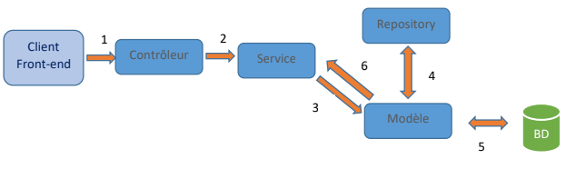
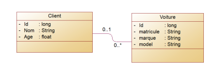

# Microservices-Based Application - Client and Car Services

This project implements a Microservices (M.S.) architecture consisting of two main services: Client Service and Car Service. The Client Service interacts with a MySQL database containing client information related to car purchases, while the Car Service manages data about cars in a separate MySQL database.

## Table of Contents

- [Overview](#overview)
- [Architecture](#architecture)
- [Setup](#setup)
- [Usage](#usage)
- [Configuration](#configuration)
- [Contribution](#contribution)
- [Testing](#testing)
- [License](#license)
- [Contact](#contact)
- [Acknowledgments](#acknowledgments)

## Overview

The primary goal of this project is to demonstrate a Microservices architecture with two crucial components: the Client Service and the Car Service. These services communicate to maintain data integrity and consistency between the databases storing client and car information.

## Architecture

### Client Service

- Manages client data stored in a MySQL database.
- Interacts with the Car Service for maintaining data coherence.

### Car Service

- Handles information related to cars stored in a separate MySQL database.
- Communicates with the Client Service for data consistency.

 <!-- Replace 'path_to_class_diagram_image' with the actual path or link to the class diagram image -->

## Setup

### Prerequisites

- Java SDK
- MySQL
- IDE (Eclipse, IntelliJ, etc.)

### Installation

1. Clone the repository.
2. Navigate to each service directory (Client Service, Car Service) and follow the README instructions for setup.
   <!-- Provide specific instructions or link to detailed setup steps -->

## Usage

### Client Service

- Endpoint: `/clients`
- API endpoints:
- - `GET /clients`: Retrieve clients information.
  - `GET /clients/{id}`: Retrieve client information by ID.
  - `POST /clients`: Add a new client.
  - `PUT /clients/{id}`: Update client information by ID.
  - `DELETE /clients/{id}`: Delete client by ID.
  <!-- Provide additional usage details or examples -->

### Car Service

- Endpoint: `/voitures`
- API endpoints:
  - `GET /voitures/client/{id}`: Retrieve car information by client ID.
  <!-- Provide additional usage details or examples -->

## Configuration

The services might require configurations for database connections, service discovery (e.g., Eureka), and communication protocols. Details on configuration options and their impacts are available in the respective service directories.

## Contribution

Contributions are welcome! Please follow the guidelines outlined in the CONTRIBUTING.md file.

## Testing

Testing details and instructions are available in the `test/` directory of each service. To run tests, use the following commands:
- Client Service: `mvn test`
- Car Service: `./gradlew test`

## License

This project is licensed under the [MIT License](link_to_license).

## Contact

For any queries or concerns, feel free to contact the project maintainers:
- [Laaziz Ahmed](mailto:laazizahmed72@gmail.com)

## Acknowledgments

- Mention any individuals, libraries, or resources that contributed to the project.
